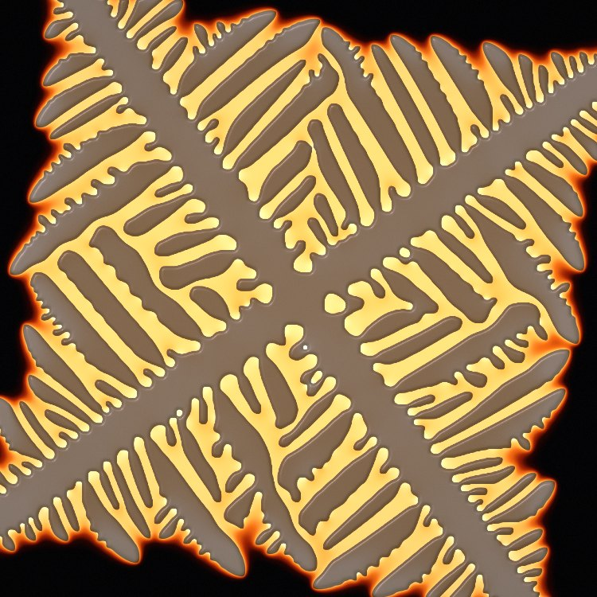
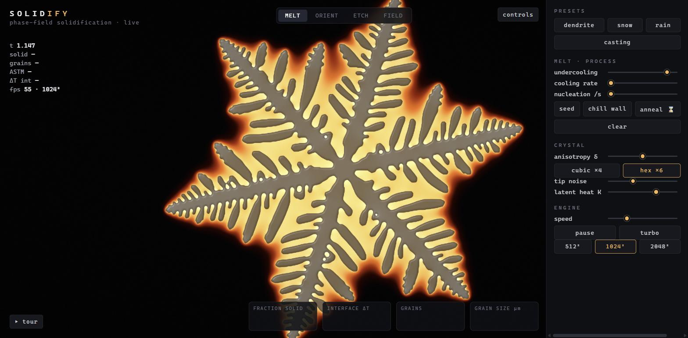
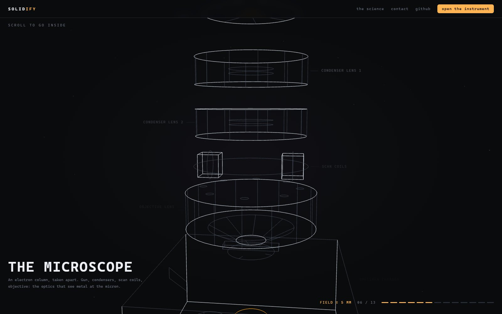
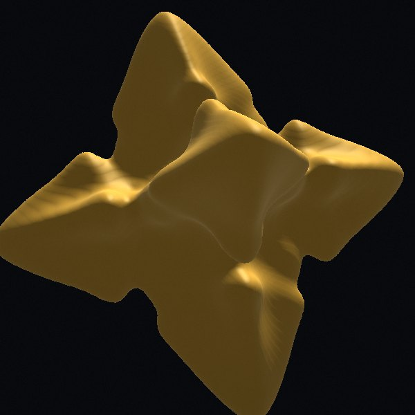

# SOLIDIFY — watch metal freeze

**Live: [solidify.frankcai.dev](https://solidify.frankcai.dev/)** (needs WebGPU — Chrome/Edge, Safari 26+, recent Firefox)

A real-time **phase-field solidification instrument** that runs entirely in your browser on WebGPU.
Undercool a melt, tap to nucleate crystals, and watch dendrites grow, branch, collide, and become
grains — then read the result like a metallographer: etched micrograph view, grain-size histogram,
live ASTM grain number.



Switch the crystal symmetry from cubic (×4) to hexagonal (×6) and the same equations grow a
snowflake — shown here in cross-polarised (orientation) view:



The landing page opens with a scroll-driven descent — from the GPU running the solver, down
through the die, an electron column, the specimen, and out to a synchrotron — every scene a live
3D wireframe:



## What it simulates

The Kobayashi (1993) anisotropic phase-field model for a pure undercooled melt, extended to
many grains:

- **φ (order parameter)** — anisotropic Allen–Cahn dynamics with a j-fold surface-energy
  anisotropy ε(θ) = ε̄(1 + δ cos j(θ − θ₀)) and stochastic interface noise for side-branching.
- **T (temperature)** — heat diffusion with latent-heat release K·∂φ/∂t. The glowing halo around
  every growing tip *is* the latent heat; growth stalls when recalescence warms the interface back
  to the melting point.
- **Grains** — each nucleus carries its own crystallographic orientation θ₀ in a grain-ID field
  that propagates just ahead of the front; grain boundaries appear where fronts collide, with no
  extra model terms.

Numerics: explicit Euler on a 512²–2048² grid, compact 9-point Laplacians (checkerboard-free),
divergence-form anisotropy, all in WGSL compute shaders — roughly a billion cell-updates per
second on a mid-range discrete GPU, with GPU-fence backpressure so slow devices throttle
gracefully instead of freezing.

## TRUE 3D mode

Flip one switch and the instrument solves the **full volumetric phase-field** — up to
**192³ ≈ 7.1 million voxels** — and raymarches it live:



- **Real 3D crystallography** — per-grain quaternion orientations; cubic ⟨100⟩ anisotropy grows
  six-armed dendrites, the hexagonal K₆ + c-axis form grows plates or needles (habit slider).
  Shift-tap seeds a Σ3 twin pair (60° about a shared ⟨111⟩).
- **CAD-style camera** — orbit/dolly/pan plus a Fusion-style ViewCube with face/edge/corner
  snapping, tap-to-nucleate at depth.
- **Nine lenses** on the volume — MELT, ORIENT, SLICE, FIELD (x-ray), SEM, RINGS, THERM, NEON,
  CURV.
- **Serial sectioning** — a free section plane (depth/tilt/turn) with a CT sweep mode; the cut
  face renders as Nital/Klemm's/Beraha's etches, an EBSD IPF map, or a Niyama porosity-risk map.
- **Shrinkage porosity** — a generation-stamped feed flood from the riser marks starved liquid;
  pockets that solidify unfed become pores that x-ray dark in FIELD, with live porosity % and the
  Niyama criterion recorded at every freezing voxel.
- **Stereology + IPF panels** — grain size measured on the section plane vs the true 3D census
  (the classic stereological underestimate, live), and an inverse-pole-figure texture scatter.
- **Take it home** — export the crystal as a watertight **STL** (surface-nets mesh, printable),
  record a 6-second **360° turntable** webm, or share the whole setup as a link.
- **Guided tour part III** — "Into the volume": five chapters from the first six-armed dendrite
  to porosity NDT and the STL export.

Budget: ~396 MB VRAM at 192³ with an OOM ladder down to 96³; 2D mode is untouched at 60 fps.

## The instrument

- **Ten lenses** — MELT (incandescent blackbody), ORIENT (cross-polarized grains), ETCH
  (micrograph + scale bar), FIELD (T + isotherms), RINGS (solidification-time isochrones),
  THERM (FLIR ironbow), SEM (secondary-electron look), NEON (glowing contours), XRAY
  (synchrotron-radiograph absorption, shows solute), CURV (Gibbs–Thomson curvature).
- **Scenarios** — free growth, Bridgman directional solidification (pulled gradient frame),
  and a steerable/auto-raster laser weld that remelts and resolidifies the microstructure.
- **Alloy mode** — Warren–Boettinger-type dilute solute (qualitative): constitutional
  undercooling, solute halos, frozen-in microsegregation, composition/partition/liquidus sliders.
- **Materials** — ten qualitative identities (model metal, Al–Cu, Fe–C steel, Ni superalloy,
  Co alloy, copper, Mg AZ91, Zn spangle, ice, succinonitrile). Crystal structure picks the
  dendrite symmetry (FCC/BCC → 4-fold, HCP → 6-fold — and yes, cobalt freezes FCC), and each
  material sets anisotropy, latent heat, alloy bundle, and how brightly its melt actually
  glows: steel pours white-hot, zinc at 420 °C is just liquid silver.
- **Alloy composer** — build your own composition: pick a base (Al/Fe/Ni/Mg/Cu/Zn), add
  elements in wt% with live at% conversion, using approximate textbook dilute-limit binary
  coefficients (liquidus slope m, partition k per element). The composer reports the real
  chemistry — liquidus shift ΔT_L = Σmᵢcᵢ and growth restriction factor Q = Σmᵢcᵢ(kᵢ−1) —
  then collapses the mix onto the model's pseudo-binary solute field (k_eff = the mᵢcᵢ-weighted
  mean partition), with every clamp labelled. Famous-alloy quick-fills (A356, AA2024, 4340,
  IN718, AZ91, bronze…) and shareable `#alloy=…` deep links. Verified: A356+TiB (Q ≈ 71 K)
  vs Al–1Zn (Q ≈ 1 K) under identical nucleation gives 369 vs 46 grains — composition alone
  refines the structure, the Easton–StJohn mechanism emerging from the phase-field.
- **Twinning** — stochastic growth twins nucleate at the front in twin registry (θ₀ + π/j) and
  must out-grow their parent to survive, like real feathery grains in aluminum DC casting;
  Shift+click stamps a twinned seed pair — in hexagonal mode that grows the rare
  12-branched snowflake. Twin boundaries etch faint, as in real metallography.
- **Process controls** — undercooling, cooling rate, activation-gated nucleation rain, chill
  wall, anneal-to-remelt, symmetry, anisotropy, noise, latent heat, brush size, and a pro panel
  (ε̄, γ, α, τ, k) for power users. Reset arms a staged melt; run/pause/turbo transport.
- **Looks & navigation** — scroll-zoom + right-drag pan in any lens, pixel mode (chunky
  nearest-neighbour cells) and an 8-bit dithered palette toggle.
- **Live metallography** — fraction solid, interface undercooling, grain count, grain-size
  histogram, ASTM G number, computed by GPU reduction while the sim runs.
- **Analysis instruments** — a cooling-curve probe (foundry thermal analysis: watch the
  recalescence arrest at the liquidus; ctrl-tap moves the probe), a Scheil overlay
  (analytic T(fs) path vs the measured interface temperature), and an SDAS ruler that
  measures secondary-arm spacing by dragging a linear-intercept line, metallographer-style.
- **Recorder** — one-button ⏺ capture of the canvas to a .webm clip.
- **Touch** — pinch to zoom, two-finger pan, tap to nucleate.
- **The science page** — [/science/](https://solidify.frankcai.dev/science/) documents the
  equations, the numerics, what's quantitative vs qualitative, and the references.
- **Guided tour** — ten chapters from the Mullins–Sekerka instability through twinning,
  casting CET, directional growth, welding, and alloys.
- **Engineer it & challenge** — a separable CMA-ES optimizer runs casting after casting,
  measures each ASTM grain number, and learns the schedule — every attempt pinned to a
  lab-notebook strip. Challenge mode deals you the same target first and scores you against it.

## Running

Needs a browser with WebGPU (Chrome/Edge, Safari 26+, recent Firefox).

```bash
npm install
npm run dev      # local dev server
npm run build    # static build in dist/
```

No frameworks, no external assets: Vite + TypeScript + raw WebGPU, ~2.5k lines.

## Physics sanity checks

- Single-crystal morphology reproduces the canonical Kobayashi '93 figures (parabolic tips,
  side-branches only with noise, arm count follows j).
- Liquid is metastable: no growth without a nucleus; homogeneous noise cannot freeze the melt.
- Slider ranges are clamped to the numerically stable envelope of the explicit scheme.
- ASTM G from mean grain area (E112), on a nominal 1 mm domain scale, honestly labelled.
