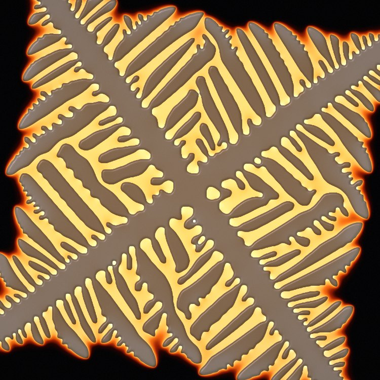
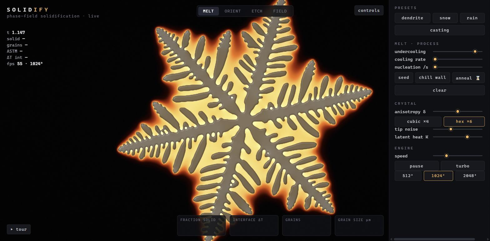
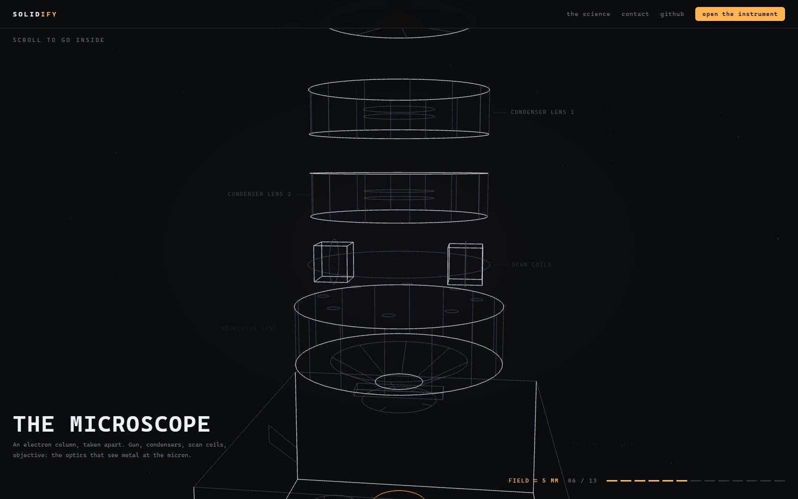
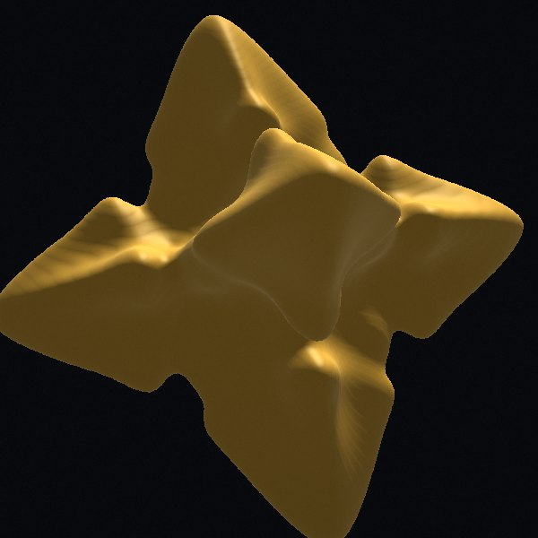

# SOLIDIFY — watch metal freeze

**Live: [solidify.frankcai.dev](https://solidify.frankcai.dev/)** (needs WebGPU — Chrome/Edge, Safari 26+, recent Firefox)

A real-time **phase-field solidification instrument** that runs entirely in your browser on WebGPU.
Undercool a melt, tap to nucleate crystals, and watch dendrites grow, branch, collide, and become
grains — then read the result like a metallographer: etched micrograph view, grain-size histogram,
live ASTM grain number.



Switch the crystal symmetry from cubic (×4) to hexagonal (×6) and the same equations grow a
snowflake — shown here in cross-polarised (orientation) view:



The landing page opens with a scroll-driven descent — from the GPU running the solver, down
through the die, an electron column, the specimen, and out to a synchrotron — every scene a live
3D wireframe:



## What it simulates

The Kobayashi (1993) anisotropic phase-field model for a pure undercooled melt, extended to
many grains:

- **φ (order parameter)** — anisotropic Allen–Cahn dynamics with a j-fold surface-energy
  anisotropy ε(θ) = ε̄(1 + δ cos j(θ − θ₀)) and stochastic interface noise for side-branching.
- **T (temperature)** — heat diffusion with latent-heat release K·∂φ/∂t. The glowing halo around
  every growing tip *is* the latent heat; growth stalls when recalescence warms the interface back
  to the melting point.
- **Grains** — each nucleus carries its own crystallographic orientation θ₀ in a grain-ID field
  that propagates just ahead of the front; grain boundaries appear where fronts collide, with no
  extra model terms.

Numerics: explicit Euler on a 512²–2048² grid, compact 9-point Laplacians (checkerboard-free),
divergence-form anisotropy, all in WGSL compute shaders — roughly a billion cell-updates per
second on a mid-range discrete GPU, with GPU-fence backpressure so slow devices throttle
gracefully instead of freezing.

## TRUE 3D mode

Flip one switch and the instrument solves the **full volumetric phase-field** — up to
**192³ ≈ 7.1 million voxels** — and raymarches it live:



- **Real 3D crystallography** — per-grain quaternion orientations; cubic ⟨100⟩ anisotropy grows
  six-armed dendrites, the hexagonal K₆ + c-axis form grows plates or needles (habit slider).
  Shift-tap seeds a Σ3 twin pair (60° about a shared ⟨111⟩).
- **CAD-style camera** — orbit/dolly/pan plus a Fusion-style ViewCube with face/edge/corner
  snapping, tap-to-nucleate at depth.
- **Nine lenses** on the volume — MELT, ORIENT, SLICE, FIELD (x-ray), SEM, RINGS, THERM, NEON,
  CURV.
- **Serial sectioning** — a free section plane (depth/tilt/turn) with a CT sweep mode; the cut
  face renders as Nital/Klemm's/Beraha's etches, an EBSD IPF map, or a Niyama porosity-risk map.
- **Shrinkage porosity** — a generation-stamped feed flood from the riser marks starved liquid;
  pockets that solidify unfed become pores that x-ray dark in FIELD, with live porosity % and the
  Niyama criterion recorded at every freezing voxel. As of v6.2 the record is honest to its own
  definition (the non-latent environment rate, −1 where no front ever passed, gated against a
  discrete CPU recount) and converts to real K·s^½·mm⁻¹ — judged against Niyama's cited 0.775
  steel radiographic threshold for steel, and refusing by name to judge any other alloy class.
  The lab card adds the Clyne–Davies hot-tearing timing ratio off the pour's own f_s(t), labelled
  as a timing ratio: RDG needs mechanics this solver does not carry.
- **Stereology + IPF panels** — grain size measured on the section plane vs the true 3D census
  (the classic stereological underestimate, live), and an inverse-pole-figure texture scatter.
- **Take it home** — export the crystal as a watertight **STL** (surface-nets mesh, printable),
  record a 6-second **360° turntable** webm, or share the whole setup as a link.
- **Reproducible casts** (v7.0) — every stochastic choice (grain orientations, where the
  nucleation sites sit, what undercooling each activates at) descends from one seed, which is
  printed in the rail and packed into share links. So a shared link pours the *same casting*, not
  a statistically similar one. The seed is drawn fresh on each visit rather than fixed — an
  instrument that showed the identical snowflake on every reload would be a worse instrument —
  but it is always recorded, which is what makes a result something you can hand to someone else.
- **Guided tour part III** — "Into the volume": five chapters from the first six-armed dendrite
  to porosity NDT and the STL export.
- **The full instrument** (v3.0) — everything from 2D now runs in the volume: the dilute-alloy
  solute field + composer (lazily-allocated solute textures, +57 MB only while on), Bridgman
  directional growth up the z-axis, a steerable top-surface laser weld, stochastic **Σ3 growth
  twins spawned GPU-side at the moving front**, cusped {100} **faceted growth**, the
  **icosahedral quasicrystal** answer to the forbidden 5-fold, all nine presets, the cooling
  probe / Scheil overlay / SDAS ruler / pole figure instruments, retro voxel + 8-bit looks, and
  3D share links that carry the whole setup.
- **The grain selector** (3D-only showpiece) — a helical pigtail channel under the Bridgman
  pull: dozens of chill-floor grains race in, **exactly one** exits into the blade cavity —
  the real mechanism behind single-crystal turbine blades. The 64 grains are a real seeding
  constant — `chillFloor` plants an 8 × 8 jittered grid — but the **one** is not measured. The
  headless gate (`SELECTOR3`) stages the preset and asserts one thing: that the scenario armed.
  It reads no grain count, and it does not check the pigtail mask either.
- **Shaped moulds** (v6.2) — the lab's mould is a rasterized geometry library (shell, plate,
  **step block**, wedge) behind one public voxel-mask entry point, with the feed flood, chill
  floor and nucleation staging all made mask-aware so a sealed chamber can no longer be fed or
  seeded through a wall. The step block is the classic foundry teaching casting: four section
  thicknesses fed from one common pour, each freezing at its own rate from wall-conduction
  geometry alone, each independently measured by a per-section census (thickness · local d̄ ·
  σ_y, thinnest first) on the report card.

Budget: 57 B/voxel over nine textures — six fields, three of them ping-pong pairs — ~403 MB VRAM
at 192³ (+57 MB solute while alloy is on),
with an OOM ladder down through 160³/128³/96³, all four selectable in the ENGINE row;
2D mode is untouched at 60 fps.

## The instrument

- **Ten lenses** — MELT (incandescent blackbody), ORIENT (cross-polarized grains), ETCH
  (micrograph + scale bar), FIELD (T + isotherms), RINGS (solidification-time isochrones),
  THERM (FLIR ironbow), SEM (secondary-electron look), NEON (glowing contours), XRAY
  (synchrotron-radiograph absorption, shows solute), CURV (Gibbs–Thomson curvature).
- **Scenarios** — free growth, Bridgman directional solidification (pulled gradient frame),
  and a steerable/auto-raster laser weld that remelts and resolidifies the microstructure.
- **Alloy mode** — Warren–Boettinger-type dilute solute (qualitative): constitutional
  undercooling, solute halos, frozen-in microsegregation, composition/partition/liquidus sliders.
- **Materials** — eleven qualitative identities (model metal, Al–Cu, Fe–C steel, Ni superalloy,
  Co alloy, copper, Mg AZ91, Zn spangle, ice, succinonitrile, and the Al–Co–Ni decagonal
  quasicrystal, whose 10-fold interface energy is modelled and whose aperiodic lattice is
  not). Crystal structure picks the
  dendrite symmetry (FCC/BCC → 4-fold, HCP → 6-fold — and yes, cobalt freezes FCC), and each
  material sets anisotropy, latent heat, alloy bundle, and how brightly its melt actually
  glows: steel pours white-hot, zinc at 420 °C is just liquid silver.
- **Alloy composer** — build your own composition: pick a base (Al/Fe/Ni/Mg/Cu/Zn), add
  elements in wt% with live at% conversion, using approximate textbook dilute-limit binary
  coefficients (liquidus slope m, partition k) carried **per (base, solute) pair** rather than
  per element — aluminium appears as a solute under three different bases with three different
  coefficients, and titanium changes sign between Al and Ni. Since v7.1 every pair also carries
  its own cited `source`, and every pair has a binary invariant row in `src/phasedata.ts` whose
  numbers are independently recomputed from open CALPHAD databases (`docs/PHASE-AUDIT.md`). That
  table carries a version — currently 1.1.0 — which is bumped on any row change and which
  `PD-DOC-CONSTANTS` requires this file and the science page to quote, so a retired invariant
  cannot sit in a document after the table has moved on. The composer reports the real
  chemistry — liquidus shift ΔT_L = Σmᵢcᵢ and growth restriction factor Q = Σmᵢcᵢ(kᵢ−1) —
  then collapses the mix onto the model's pseudo-binary solute field (k_eff = the mᵢcᵢ-weighted
  mean partition), with every clamp labelled — and since v7.1 P1 the clamps and refusals render
  *outside* the composer too, beside the alloy name and on the heat-treat card, so a deep-linked
  melt carries its own caveats. Pouring while the calibrated solver is running now recalibrates on
  the poured mix's own m and k rather than the base material's: 4340 steel used to measure one
  dimensionless degree as 1504 K, because `materials.ts`'s steel entry is Fe–C. Where the dilute
  model's reference liquid c∞/k is a composition the alloy never reaches, the readout says
  `EXTRAPOLATED GAUGE` and prints the real primary freezing range beside it; where the mix does not
  collapse onto a pseudo-binary at all, it declines and names the clause. Famous-alloy quick-fills
  (A356, AA2024, 4340, IN718, AZ91, bronze…) and shareable `#alloy=…` deep links. Since v7.1 P2
  the composer also **draws the diagram**: the dominant binary as straight chords between the
  cited invariants, the pour pinned at the melt's own liquidus with the residual from the other
  solutes labelled, a second dashed line wherever a model clamp moved the depression the solver
  integrates, and a live cursor that is absent rather than zero when there is no melt to read.
  v7.1 P3 adds the two columns the drawing exists for — **phases equilibrium predicts** against
  **phases this solver grows**, which is always exactly one — with the share that freezes at the
  invariant printed for a eutectic (A356: 49 % by the lever rule, 51 % by Gulliver–Scheil, and
  none of it grown here) and refused for a peritectic, where the share that freezes at the
  invariant is not the liquid fraction there. What a peritectic prints instead is sharper:
  1045 steel's carbon is past the peritectic's own product composition, so L + δ → γ consumes the
  δ-ferrite entirely and the casting ends as austenite — the phase this solver grows is not in
  the frozen casting at all. Below the solubility limit the readout still gives Gulliver–Scheil
  its say, because a dendritic solidifier that called AZ91 single-phase would be hiding the
  11.9 % β-Mg17Al12 that is its textbook as-cast constituent. The composition ceiling is now derived rather than assumed: each solute stops at the
  smaller of its hand-picked ergonomic cap and one step below the invariant its primary phase
  changes at, and for five of the twenty-five pairs the diagram is the smaller one — which
  removes cast iron: Fe–C stops at 0.52 wt% C against a 0.53 wt% peritectic,
  past which the primary phase is austenite and this solver grows δ-ferrite. And since v7.1 P5
  the element list is no longer closed: under the quick solute list — six entries at the most,
  and as few as one over a zinc melt — sits the **whole periodic
  table**, 118 cells coloured for the melt you are standing over, and tapping any of them gets an
  answer computed from a cited number. 25 of the 708 (base, element) pairs are pourable and the
  other 683 are refusals that say why — "mercury at 1 wt% exerts 0.053 atm over liquid aluminium,
  and pure mercury would exert 39" teaches more than an element you simply cannot see. Switching
  the base from aluminium to iron recolours 14 cells and puts a fume stripe under ten more whose
  tier does not move at all, because the vapour rule is evaluated at the pure base's melting
  point and every one of those ten boils between aluminium's 660 °C and iron's 1538 °C.
  Opening the input added no chemistry: the assessed tier is
  exactly the 25 pairs that already had both a cited coefficient row and a cited invariant, and
  every preset still derives a bit-identical parameter bundle.
- **Twinning** — stochastic growth twins nucleate at the front in twin registry (θ₀ + π/j) and
  must out-grow their parent to survive, like real feathery grains in aluminum DC casting;
  Shift+click stamps a twinned seed pair — in hexagonal mode that grows the rare
  12-branched snowflake. Twin boundaries etch faint, as in real metallography.
- **Nucleation you cannot cheat** — there is no "nuclei per second" slider, because that is not
  a thing you set. You charge the melt with an **inoculant**: n_max potential sites, each with
  its own activation undercooling drawn from a Gaussian, each firing once when the melt first
  gets that cold (Thévoz–Rappaz site distribution + Greer free-growth activation). Sites only
  fire on a *new* maximum undercooling, so recalescence stops nucleation by itself, and cooling
  the same charge faster reaches a deeper undercooling before that happens — more sites fire,
  finer casting. The test suite asserts exactly that coupling.
- **Lab mode** — the instrument's other half: instead of dragging sliders at a running melt, you
  specify the experiment first (charge + inoculant, hold time above the liquidus, atmosphere,
  pour superheat, mould temperature and shape (3D: shell/plate/step/wedge), a
  furnace/air/quench/soak cooling programme, and optionally a pre-pour strength spec), pour it,
  and read a **report card**. As of v6.1 the card is read
  the way a foundry reads a cast cup: T_L / T_N / recalescence / T_S extracted from the cooling
  curve by real thermal analysis (with the method's own error against the measured f_s printed,
  not tuned away), dissolved hydrogen by Sievert's law with the Ransley–Neufeld solubilities
  (atmosphere-ordered, zero under vacuum), refiner fade over the hold (settling is why you pour
  promptly), and the as-cast census with its Hall–Petch σ_y — **judged pass/fail against the
  spec as dialled at the pour**, at the precision the card prints, with the same one verdict
  logic the furnace card uses. Change a dial mid-pour and the card says so. Pour the step block
  and the card gains a per-section table — thickness · local d̄ · σ_y, thinnest first — the same
  census machinery run four times over four regions of one casting.
- **Heat treatment — the second clock** — a real schedule (°C, hours) on a separate clock ~11
  orders longer than solidification: Arrhenius integrals over the whole trajectory set a budget,
  measured Potts kinetics spend it; annealing twins in the volume (Cu and Co twin, Al and Ni
  refuse with their Murr-1975 numbers), homogenization at frozen φ, oxide/decarb card lines, and
  a Hall–Petch `σ_y` row judged against a spec you commit before the run. What it cannot honestly
  run it refuses, each with its own sentence — incipient melting, and the domain limit with the
  analytic answer still printed.
- **Process controls** — undercooling, cooling rate, inoculant charge (+ potency and spread), chill
  wall, reheat-to-remelt, symmetry, anisotropy, noise, latent heat, brush size, and a pro panel
  (ε̄, γ, α, τ, k) for power users. Reset arms a staged melt; run/pause plus a ×1/×2/×4
  fast-forward multiplier on the transport.
- **Looks & navigation** — scroll-zoom + right-drag pan in any lens, pixel mode (chunky
  nearest-neighbour cells) and an 8-bit dithered palette toggle.
- **Live metallography** — fraction solid, interface undercooling, grain count, grain-size
  histogram, ASTM G number, computed by GPU reduction while the sim runs.
- **Analysis instruments** — a cooling-curve probe (foundry thermal analysis: watch the
  recalescence arrest at the liquidus; ctrl-tap moves the probe), a Scheil overlay
  (analytic T(fs) path vs the measured interface temperature), and an SDAS ruler that
  measures secondary-arm spacing by dragging a linear-intercept line, metallographer-style.
- **Recorder** — one-button ⏺ capture of the canvas to a .webm clip.
- **Touch** — pinch to zoom, two-finger pan, tap to nucleate.
- **The science page** — [/science/](https://solidify.frankcai.dev/science/) documents the
  equations, the numerics, what's quantitative vs qualitative, and the references.
- **Guided tour** — three parts, 32 chapters: the physics from the Mullins–Sekerka instability
  through twinning, casting CET, directional growth, welding, alloys and heat treatment; a
  control-by-control walk through every panel of the instrument; and "out of the plane" for
  the volume.
- **Engineer it & challenge** — a separable CMA-ES optimizer runs casting after casting,
  measures each ASTM grain number, and learns the schedule — every attempt pinned to a
  lab-notebook strip. Challenge mode deals you the same target first and scores you against it.

## Running

Needs a browser with WebGPU (Chrome/Edge, Safari 26+, recent Firefox).

```bash
npm install
npm run dev      # local dev server
npm run build    # static build in dist/
```

No frameworks, no external assets: Vite + TypeScript + raw WebGPU.

## Physics sanity checks

- Single-crystal morphology reproduces the canonical Kobayashi '93 figures (parabolic tips,
  side-branches only with noise, arm count follows j).
- Liquid is metastable: no growth without a nucleus; homogeneous noise cannot freeze the melt.
- Slider ranges are clamped to the numerically stable envelope of the explicit scheme.
- ASTM G from mean grain area (E112), measured against the model resolution set in the
  SCALE panel.

## Real units, and what they cost

The solver is dimensionless. Three factors convert it to SI, and only one of them is a
choice:

| factor | value | where it comes from |
|---|---|---|
| kelvin per unit | ≈249 K for Al, ≈44 K for water | **forced** — it is `(L/c_p)/K`, the heat equation's own latent coupling |
| µm per cell | you set it | the model's physical resolution; the domain is `n × µm/cell` |
| seconds per unit | derived | **forced** by whichever diffusivity is transporting |

So the app reads in °C, K, K/s, seconds and µm, and the SCALE panel shows each factor with
its provenance — nothing is presented as a result when it was a choice, or as a choice when
it was pinned. It also names the dimensionless groups the model *fails*: the Stefan number
is matched by construction, but the Lewis number is ~1 where a real alloy is ~10⁴, and the
capillary ratio is undefined because the Kobayashi interface has no calibrated surface
energy. That last one is why tip radius and arm spacing here are shapes rather than
predictions — under the default solver.

## The calibrated solver

There is a second solver, and you turn it on in the SCALE panel. Karma–Rappel thin-interface
asymptotics tie the phase-field parameters to two numbers the material actually has, the
capillary length `d0 = Γ/ΔT0` and the diffusivity `D`:

```
d0 = a1 · W0 / λ          a1 = 5√2/8 = 0.8839
τ0 = a2 · λ · W0² / D     a2 = 0.6267
```

Pick λ and everything else is *forced* — the interface width, the relaxation time, the physical
size of a cell, the length of a timestep. Seven dials grey out, because they are no longer
choices. For Al–4.5Cu that is `d0 = 3.2 nm`, `W0 = 109 nm`, a 0.087 µm cell and an 89 µm field
of view at 1024², so the SDAS ruler reports arm spacings a micrograph would give.

λ is the one control left, and it is a **convergence** knob rather than a physics one: it sets
how many capillary lengths wide the diffuse interface is, and the asymptotics are exact only as
that goes to zero. So the app prints `W0/d0` next to it, and the test suite checks that the
answer does not depend on it.

In an alloy the model also carries an **anti-trapping current**. Without it, an interface of
finite width traps solute it should have rejected, which looks exactly like a larger partition
coefficient and grows a completely convincing dendrite anyway. Measured here: with the current,
`k_eff` sits on the real `k` and does not care about the interface width; without it, `k_eff`
runs 24–40 % high and the excess *grows* with the width.

What it is checked against — real numbers from the literature, not self-consistency:

| measurement | reference | result |
|---|---|---|
| steady tip velocity `V·d0/D` | Karma–Rappel 1998, 2D solvability, Δ = 0.55, ε₄ = 0.05: **0.0170** | **0.01679** (1.2 %) |
| parabolic tip radius `ρ/d0` | Tong, Beckermann, Karma & Li 2001: 27.6 | 28.8 (4.4 %) |
| critical nucleus radius | Gibbs–Thomson `R* = d0/Δ` | 0.5 % |
| independence of interface width | same answer at `W0/d0` = 1.8 → 3.6 | 6.4 % spread |
| effective partition coefficient | the real `k`, width-independent | 0.135–0.150 vs `k` = 0.15 |

One consequence arrives free. Under the calibrated alloy path one dimensionless degree is the
alloy's **freezing range** instead of `L/c_p`, so the app's own shipped nucleation potency —
the same dial, untouched — reads 11 K where the Kobayashi scaling made it 37 K. That is the
band real castings occupy, reached by fixing the temperature scale rather than by tuning
nucleation.

Limits, stated: it is **2D only** (the volume still runs Kobayashi, and the switch says so
instead of appearing and doing nothing), the Lewis mismatch is unchanged, and the expansion has
its own validity bound `τ0·V/W0 ≲ 0.2` that a deeply undercooled *pure* melt reaches by λ ≈ 4.

Two consequences worth knowing. The undercooling slider's own maximum is deeper than any
real aluminium melt reaches (249 K against a Turnbull limit near 187 K) — it turns red
there. And the same dial on water tops out at 44 K, which is essentially exactly water's
homogeneous nucleation limit.

## Heat treatment — the second clock

Everything above runs on the solidification clock: under the calibrated solver a timestep is of
order 10⁻⁷ s, so a long run is a few milliseconds of metal time. A four-hour soak is 1.4·10⁴ s —
eleven orders of magnitude away — and the phase-field solver cannot be integrated through one,
not slowly, not on a bigger GPU, not ever. So heat treatment is a **separate model on a separate
clock**, and `src/heattreat.ts` owns the map between them exactly as `units.ts` owns the
dimensionless↔SI map: real schedule (seconds, °C) → Arrhenius integral over the whole trajectory
→ a budget → a GPU pass that consumes it. φ is frozen for the duration — that is what solid
state *means* — so the two clocks never have to be reconciled.

There is no process switch. You set an environment — a temperature schedule — and the model
reports what happened: grain growth, homogenization, twinning and oxidation all fall out of the
same schedule through their own integrals. "Stress relief" is not a mode; it is
the schedule where every integral comes back negligible, and the card says so because the
arithmetic said so.

Two growth laws, one for each side of the map:

```
D^n − D₀^n = ∫ k(T) dt       the material's law — sourced n and k(T), fixes the ENDPOINT
D^m − D₀^m = K_MC · S        the model's law — measured m and K_MC, spends S Monte Carlo sweeps
```

They meet at the endpoint and nowhere else: the material law says where the grain finishes, the
Potts pass spends whatever sweeps its own kinetics need to get there, and the trajectory between
is the model's. `m` and `K_MC` are measured properties of this implementation, not assumptions —
`m = 2.44`, `K_MC = 4.79` in the plane (three casts: 2.38 / 2.44 / 2.61, overlapping bands) and
`m = 2.25`, `K_MC = 1.28` in the volume (six casts at the pinned exponent spread K/K_shipped
1.186 → 0.886, which is why the volume's drift gate is 25 % and not the 15 % it first shipped at).
Ideal curvature-driven growth is parabolic; a finite-state lattice Potts model is not, and
assuming `m = 2` was measured to cost 9 499 sweeps against the correct 1 980 — a 4.8× budget
error in a number nothing else in the app would have contradicted.

What it is checked against:

| measurement | reference | result |
|---|---|---|
| anneal endpoint, end-to-end (12 h / 520 °C, Al, 1 595 grains) | the sourced growth law: d̄ → 50.4 µm | measured 14.0 → 48.6 µm — ratio 0.963 |
| homogenization decay | discrete DCT-II eigenvalue `(1 − 2D(1 − cos k))^I` | rel-err 9·10⁻⁷ (2D and 3D), conservation to 10⁻⁷ |
| Σ3 twin registry | exact 60° about ⟨111⟩, checked against real volume adjacency | 25/26 exact; twins survive further annealing |
| oxide card lines | parabolic `x = √(∫k_p dt)`, sourced constants | Al passive film 2.3 nm after 14.5 h at 520 °C — steel scales in mm |
| Hall–Petch demo (1 h at 0.85 T_m) | `σ_y = σ0 + k_HP/√d̄`, sourced constants | Al 12 → 20.1 µm (40 → 36 MPa); steel 12 → 295.9 µm (243 → 105 MPa) |

The report card's last row is `σ_y` by Hall–Petch on the measured census — grain-size
strengthening alone, no precipitates, no work hardening, and the card says so. Dial a spec
(`σ_y ≥ N MPa`) and the met/missed verdict is judged against the spec as it stood when the run
started — a spec you can only set after the furnace is a spec you can move. The arrow is
one-way: this furnace can only coarsen, and coarser is softer, so an anneal can only soften; a
spec above the as-cast strength is called unreachable up front, because meeting a higher spec
takes a finer pour, not a schedule.

Limits, stated: φ stays frozen — the phase field is never re-solutioned, so a treatment cannot
dissolve or regrow the solid itself. T, c and age remain the as-cast record; the treatment is
isothermal by construction and the card says so, rather than showing a cold casting labelled
540 °C. The oxide scale is a card number, never painted into the fields. The twin plate is the
one inserted thing — per-cell twin spawns were built and measured dead (3/512 alive at 300
sweeps, none at 450), because a {111} stacking event is sub-grid for a per-cell Potts flip; the
plate is stamped in exact Σ3 registry and everything after birth is the pass's physics. There is
no precipitate aging and no T6 — `MaterialSI` has no precipitate kinetics, and inventing them is
the one thing this instrument does not do. Grain growth is unpinned by default (no solute drag),
and as of v7.0 the panel carries a Zener dispersion — a particle fabric the boundaries drag
through, pinned at a limit measured on this lattice (d_lim = 7.24·r^0.205/f^0.356 cells in the
plane; the volume shares the mechanism and declines to borrow the law). And grain statistics on a
188 µm volume stop meaning anything past ~64 µm, so a schedule that would go there is refused
with the law's answer still printed.
